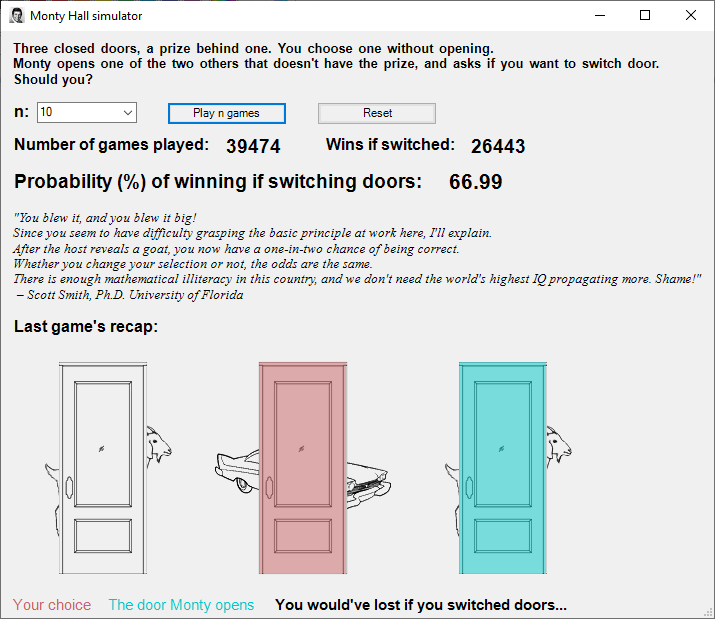

# monty-hall-powershell
GUI in powershell for a numerical answer to the Monty Hall problem.
Everything was coded into this one ps1 file, including the images.

Just right-click the ps1 file and "Run with Powershell"

## What it does
It simulates the [Monty Hall game](https://en.wikipedia.org/wiki/Monty_Hall_problem) **n** times, and calculates the probability of winning had you switched doors everytime. The expected result is two thirds.

## What it looks like
The window contains a brief description of the game, the number of games to play at a time, a few buttons, a nice quote from some guy who got it completely wrong, and the outcome of the last game played.

